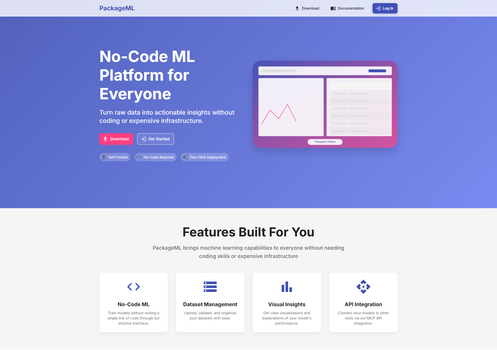
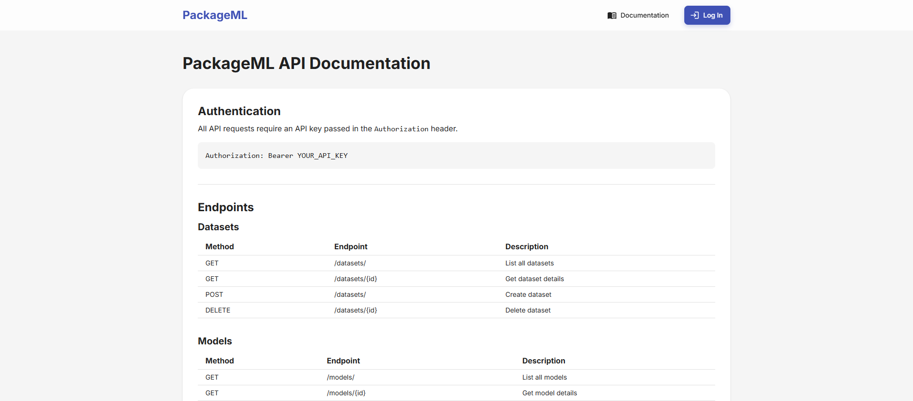
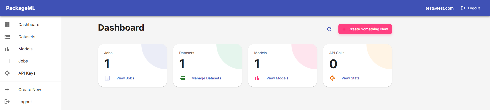
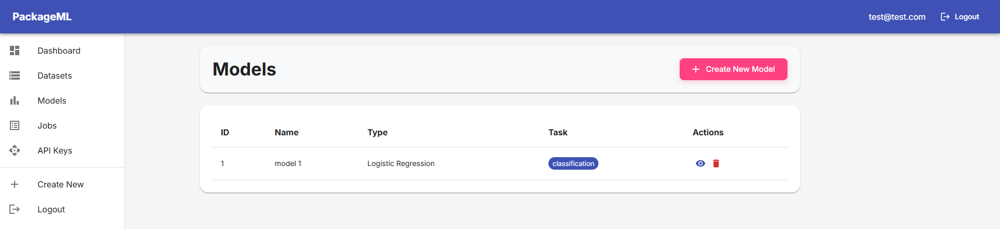
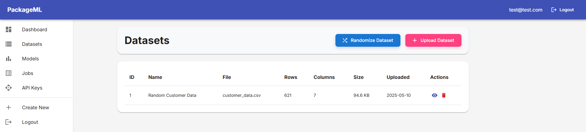
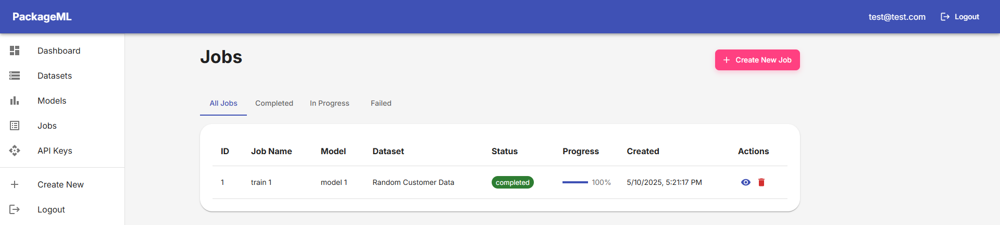
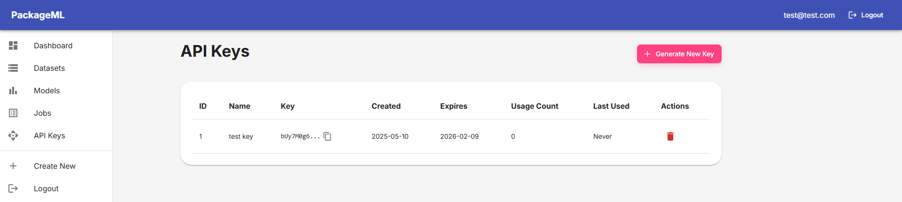

# PackageML
Please visit [https://packageml.htnminh.com](https://packageml.htnminh.com) to try it out.

## Information
[NTI X Hub AI] Hub GenAI for Future Founders: Final project

Name: **Hoang Tran Nhat Minh**

GitHub repository: https://github.com/htnminh/packageml

> [!NOTE]
> This [README.md](README.md) file, [0_prompts.md](docs/0_prompts.md) file, [hand_drawn_images](docs/hand_drawn_images) directory, [images](docs/images) directory, and [videos](docs/videos) directory are the only things that are not generated by AI in this repository.

## Preview








## How to run
```bash
git clone https://github.com/htnminh/packageml
cd packageml
docker compose up -d --build
# "sudo docker compose up -d --build" if you are on Linux
```
Open [http://localhost:3000](http://localhost:3000) to view the website.

> [!NOTE]
> I deployed this on a DigitalOcean droplet, so I have to do the following things, and you should too if you want to deploy it on a server with a domain.

Modify [docker-compose.yml](docker-compose.yml) with:
```
frontend:
  environment:
    - NODE_ENV=production
    - REACT_APP_API_URL=https://packageml.htnminh.com/api
                      # or your domain
```
Add to the nginx configuration file (usually in `/etc/nginx/` on Ubuntu):
```
location /api/ {
    proxy_pass http://backend:8000/;
    proxy_http_version 1.1;
    proxy_set_header Upgrade $http_upgrade;
    proxy_set_header Connection 'upgrade';
    proxy_set_header Host $host;
    proxy_cache_bypass $http_upgrade;
}
```
In [backend/app/main.py](backend/app/main.py), append `"https://packageml.htnminh.com"` (or your domain) into the `allow_origins` parameter of `app.add_middleware()`.

## Prompts and results
- See the **prompts** here: [Prompts](docs/0_prompts.md)
- See the **results** here: [docs](docs)

All the prompts are feed into OpenAI o3 and Claude 3.7 Sonnet, using ChatGPT (with some advanced functionalities like search and deep research), Cursor, and Claude desktop.

The replies of LLMs will be omitted, they would be unnecessarily long and hard to get. Only the final results (after my modifications) are shown.

## Other tools
- https://euangoddard.github.io/clipboard2markdown/
- https://marketplace.visualstudio.com/items?itemName=yzhang.markdown-all-in-one#table-of-contents
- https://mermaid.live/
- https://chromewebstore.google.com/detail/gofullpage-full-page-scre/fdpohaocaechififmbbbbbknoalclacl