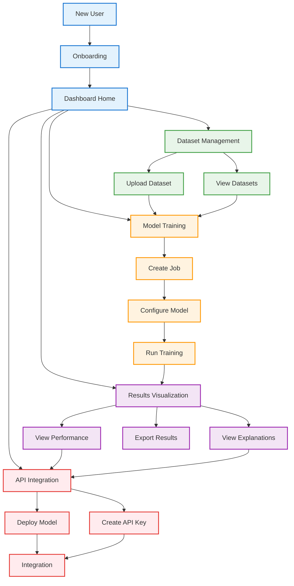

# Complete PackageML User Journey

This diagram presents the comprehensive user journey through PackageML, connecting all the primary user flows:

## 1. Entry & Onboarding
- New users begin with the onboarding process (sign-up or self-hosting)
- After authentication, all users land on the central dashboard

## 2. Core User Flows
From the dashboard, users can access four primary flows:

### Dataset Management
- Upload and configure new datasets
- View and manage existing datasets
- Datasets feed into the model training process

### Model Training
- Create new machine learning jobs
- Configure models (auto or manual)
- Run training processes
- Results feed into visualization and API deployment

### Results Visualization
- Analyze model performance
- Explore feature importance
- View natural language explanations
- Test with predictions
- Compare models

### API Integration
- Deploy models as endpoints
- Generate and manage API keys
- Access integration documentation
- Monitor API usage

## 3. Integration Points
- Dataset Management → Model Training (use datasets)
- Model Training → Results Visualization (view results)
- Results Visualization → API Integration (deploy successful models)
- API Integration → External Applications (consume predictions)

The PackageML user journey emphasizes accessibility for non-experts while providing depth for advanced users, with a focus on making ML actionable through clear visualizations and seamless API integration. 