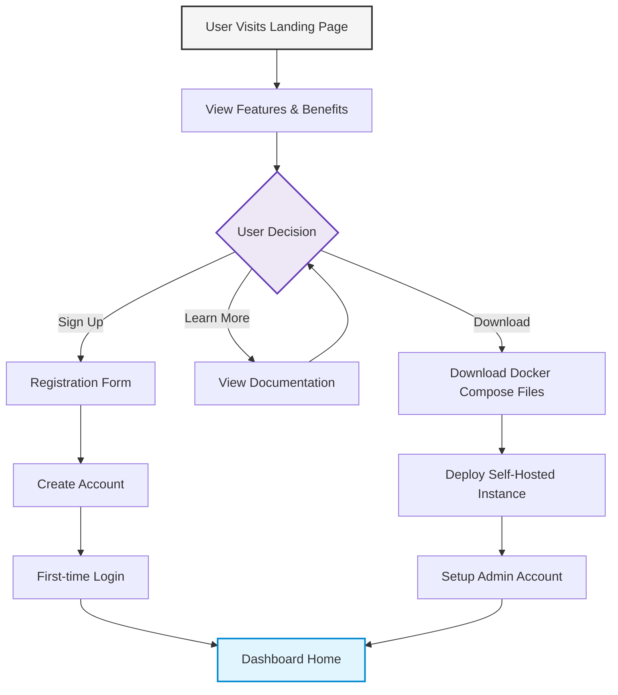

# Onboarding User Flow

This diagram shows the main onboarding paths for new users of PackageML:

1. **Landing Page Entry**: Users visit the site and learn about the platform
2. **Information Gathering**: Users can explore features, benefits, and use cases
3. **Decision Points**: Users can choose to sign up directly, learn more, or download for self-hosting
4. **Account Creation**: Standard sign-up flow leading to dashboard
5. **Self-Hosting Path**: Users can download and deploy their own instance

The onboarding is designed to accommodate both cloud users and self-hosters, with minimal friction to reach the dashboard where the core functionality begins. 