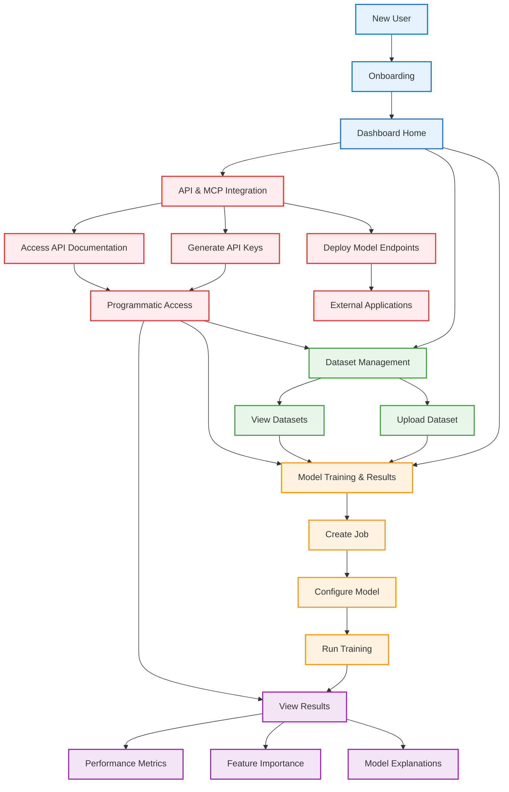

# Complete PackageML User Journey

This diagram presents the comprehensive user journey through PackageML, connecting all the primary user flows:

## 1. Entry & Onboarding
- New users begin with the onboarding process (sign-up or self-hosting)
- After authentication, all users land on the central dashboard

## 2. Core User Flows
From the dashboard, users can access three primary flows:

### Dataset Management
- Upload and configure new datasets
- View and manage existing datasets
- Datasets feed into the model training process

### Model Training & Results
- Create new machine learning jobs
- Configure models (auto or manual)
- Run training processes
- Analyze results:
  - Performance metrics and visualizations
  - Feature importance and impact analysis
  - Natural language explanations
  - Create and test predictions

### API & MCP Integration
- Generate and manage API keys with specific permissions
- Access comprehensive API documentation
- Deploy models as REST endpoints with MCP support
- Programmatically access all platform functionality:
  - Dataset management via API
  - Job creation and monitoring via API
  - Results retrieval via API
  - Predictions with context via MCP

## 3. Integration Points
- Dataset Management → Model Training (use datasets)
- Model Training → Results (immediate visualization)
- API & MCP → All Functionality (full programmatic access)
- Deployed Models → External Applications (consume predictions with context)

The PackageML user journey emphasizes accessibility for non-experts while providing depth for advanced users. The platform can be used entirely through the UI or programmatically via the comprehensive API, with the MCP ensuring context-rich integration for all predictions. 