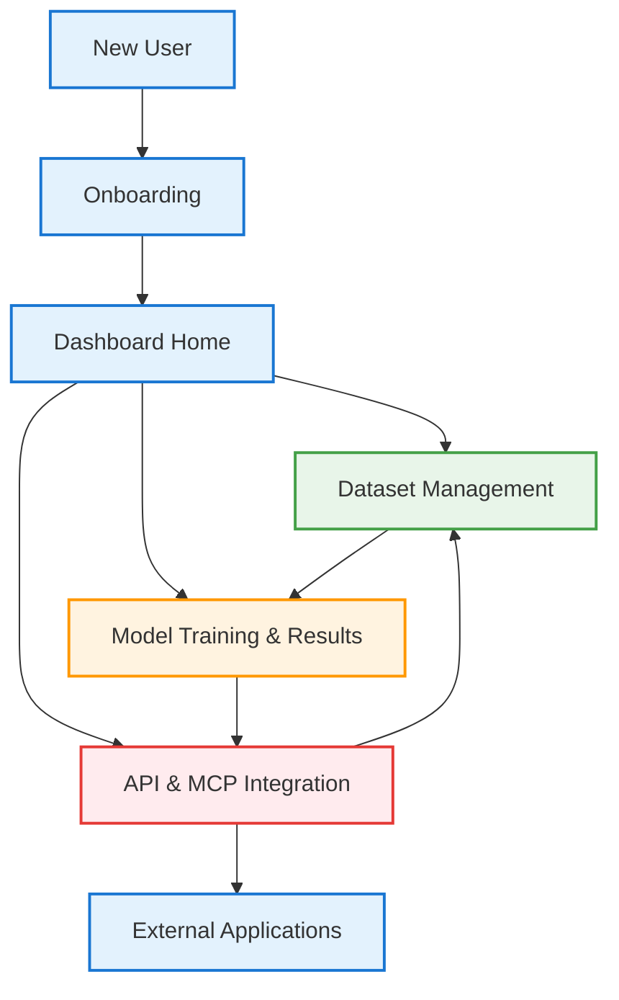

# Complete PackageML User Journey

This diagram presents the comprehensive user journey through PackageML, connecting all the primary user flows:

## 1. Entry & Onboarding
- New users begin with the onboarding process (sign-up or self-hosting)
- After authentication, all users land on the central dashboard

## 2. Core User Flows
From the dashboard, users can access three primary flows:

### Dataset Management
- Upload and configure new datasets
- View and manage existing datasets
- Datasets feed into the model training process

### Model Training & Results
- Create and run machine learning jobs
- Configure models and training parameters
- Analyze results through visualizations and explanations

### API & MCP Integration
- Full programmatic access to all platform functionality
- Deploy models as REST endpoints with MCP support
- Integrate with external applications

## 3. Integration Points
- Dataset Management → Model Training (use datasets)
- Model Training → API & MCP (deploy models)
- API & MCP → Dataset Management (programmatic access)
- API & MCP → External Applications (consume predictions with context)

The PackageML user journey emphasizes accessibility for non-experts while providing depth for advanced users. The platform can be used entirely through the UI or programmatically via the comprehensive API, with the MCP ensuring context-rich integration for all predictions. 