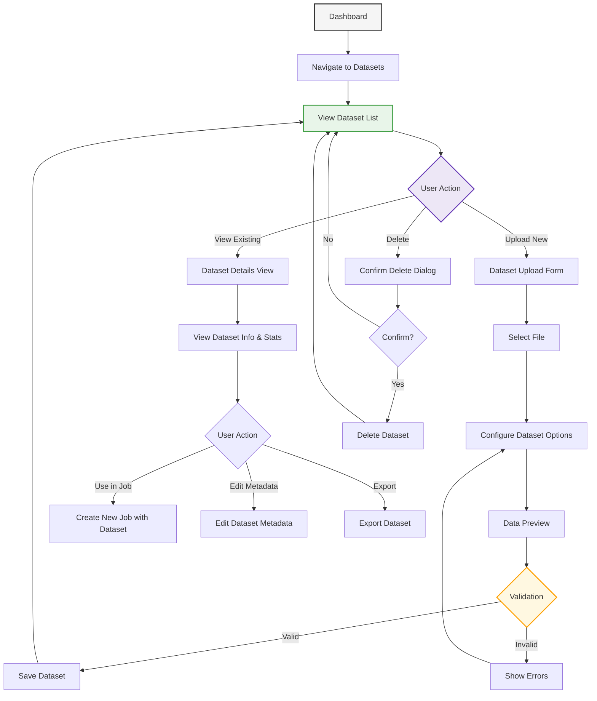

# Dataset Management User Flow

This diagram illustrates the complete dataset management flow in PackageML:

1. **Dataset Overview**: Users can view all available datasets from the dashboard
2. **Core Actions**: Upload new datasets, view existing ones, or delete datasets
3. **Upload Process**: 
   - Select dataset file (CSV, Excel, JSON)
   - Configure options (delimiter, encoding, etc.)
   - Preview data before finalizing
   - Validation checks for data quality
4. **Dataset Details**: View statistics, structure, and metadata
5. **Dataset Operations**: 
   - Use a dataset in a new ML job
   - Edit metadata (tags, description)
   - Export in various formats

The flow is designed to be intuitive, with previews and validation to ensure data quality before use in ML models. 