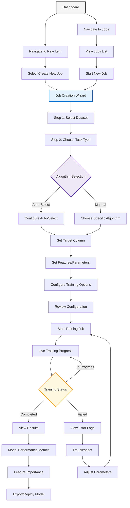

# Model Training User Flow

This diagram presents the complete model training workflow in PackageML:

1. **Entry Points**: Users can start a new job from the dashboard, jobs list, or "New Item" page
2. **Job Creation Wizard**: A step-by-step process guides users through job configuration
3. **Dataset Selection**: Users choose a dataset from previously uploaded options
4. **Task & Algorithm Selection**:
   - Choose task type (classification, regression, etc.)
   - Decide between Auto-Select (for novices) or manual algorithm choice
5. **Model Configuration**:
   - Set target variable and features
   - Configure algorithm-specific parameters
   - Set training options (validation split, etc.)
6. **Training Process**:
   - Real-time progress tracking
   - Status monitoring with success/failure paths
7. **Results Analysis**:
   - Performance metrics visualization
   - Feature importance charts
   - Model explanation in plain language
8. **Deployment Options**:
   - Export model
   - Deploy as API endpoint

The flow emphasizes a guided experience with clear steps, making ML accessible to non-experts while still providing flexibility for advanced users. 