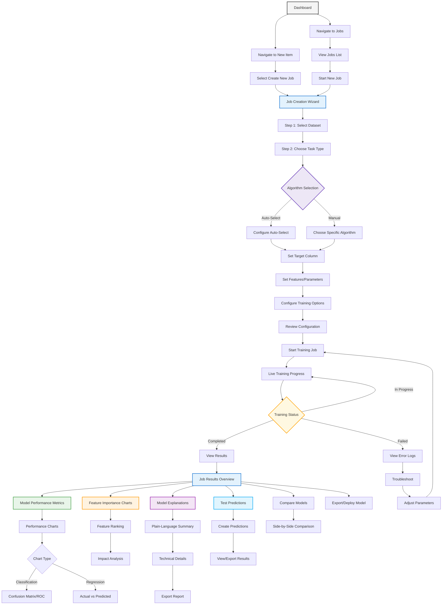

# Model Training and Results User Flow

This diagram presents the complete model training and results workflow in PackageML:

1. **Entry Points**: Users can start a new job from the dashboard, jobs list, or "New Item" page
2. **Job Creation Wizard**: A step-by-step process guides users through job configuration
3. **Dataset Selection**: Users choose a dataset from previously uploaded options
4. **Task & Algorithm Selection**:
   - Choose task type (classification, regression, etc.)
   - Decide between Auto-Select (for novices) or manual algorithm choice
5. **Model Configuration**:
   - Set target variable and features
   - Configure algorithm-specific parameters
   - Set training options (validation split, etc.)
6. **Training Process**:
   - Real-time progress tracking
   - Status monitoring with success/failure paths

7. **Results Analysis**:
   - **Performance Metrics**: View metrics relevant to the task (accuracy, F1, RMSE, etc.)
   - **Performance Charts**: Explore visualizations like confusion matrices, ROC curves, residual plots
   - **Feature Importance**: See which inputs most affect predictions and explore their impact
   - **Explanations**: Access plain-language summaries and technical details about how the model works
   - **Test Predictions**: Create predictions using new data and visualize/export results
   - **Model Comparison**: Compare multiple models side-by-side on key metrics

8. **Deployment Options**:
   - Export model for offline use
   - Deploy as API endpoint with MCP integration

The flow emphasizes a guided experience with clear steps, making ML accessible to non-experts while still providing flexibility for advanced users. Results are presented immediately in the interface after training completion, with options to export visualizations and deploy models for real-world use. 