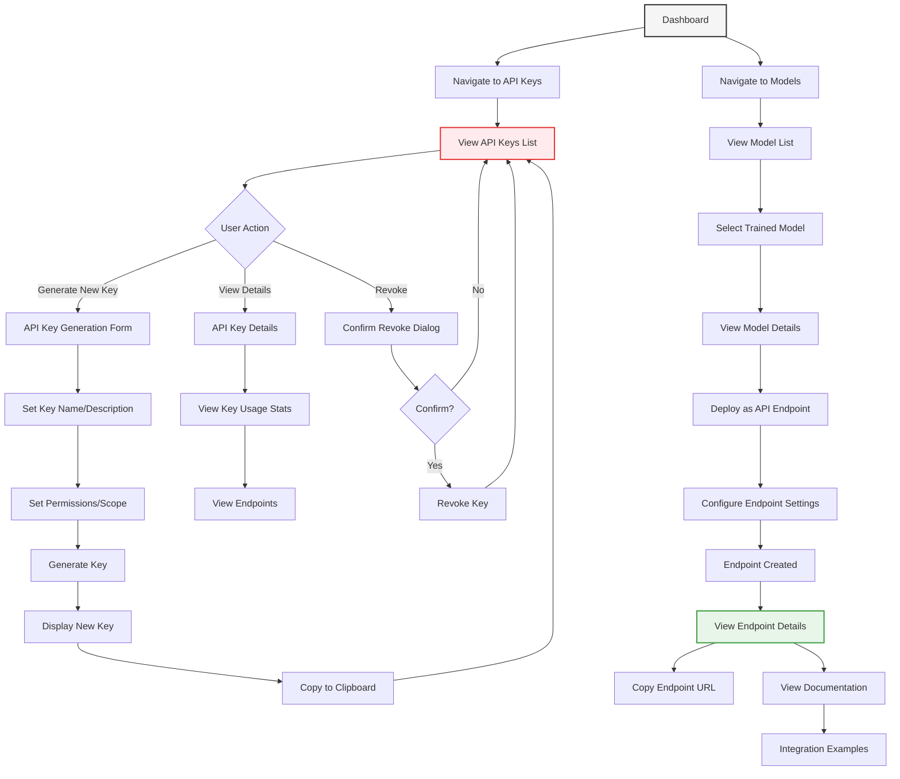

# API Integration User Flow

This diagram illustrates the API integration workflow in PackageML:

1. **API Key Management**:
   - Generate new API keys with specific permissions
   - View existing keys and usage statistics
   - Revoke keys when needed
   
2. **Model Deployment as API**:
   - Select a trained model from the models list
   - Configure deployment settings (rate limiting, caching)
   - Deploy model as a REST endpoint
   
3. **Endpoint Management**:
   - View endpoint details and performance metrics
   - Access integration documentation
   - Copy endpoint URL for use in applications
   
4. **Integration Resources**:
   - View code examples for different languages/platforms
   - Access Model-Context-Protocol (MCP) documentation
   - Test endpoint with sample requests

The API integration flow is designed to make it simple for users to expose their trained models as services that can be consumed by other applications, with a focus on security (through API keys) and ease of integration. 