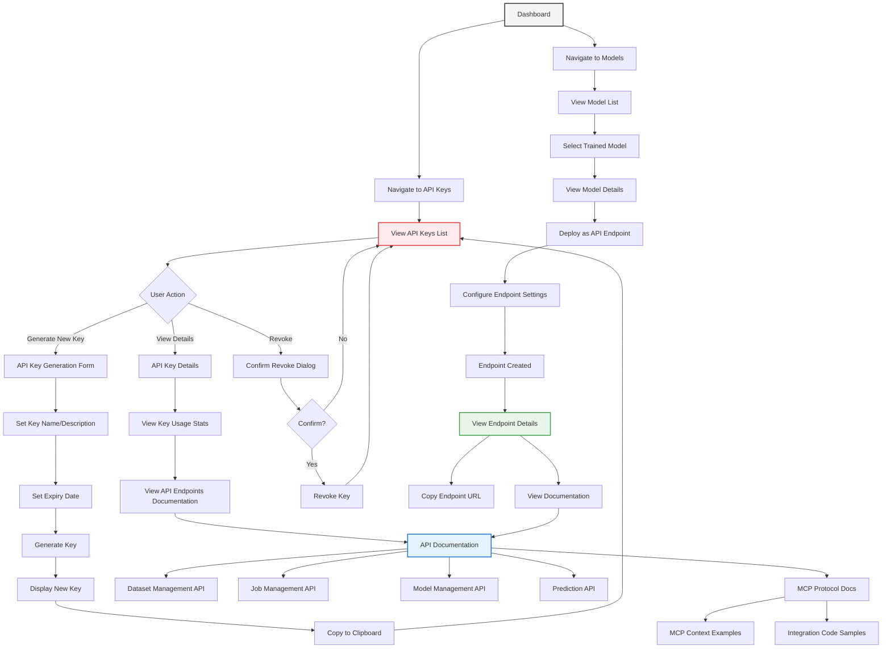

# API & MCP Integration Flow

This diagram illustrates the comprehensive API and Model-Context-Protocol (MCP) integration workflow in PackageML:

1. **API Key Management**:
   - Generate new API keys with key name and description
   - Set expiry date for security
   - View existing keys and track usage statistics
   - Revoke keys when needed for security
   
2. **Full Platform API Access**:
   - Every functionality available in the UI is also accessible via API
   - Dataset Management: upload, validate, list, and manage datasets
   - Job Management: create, configure, run, and monitor ML jobs
   - Model Management: access trained models, view metrics, export models
   - Results and Predictions: retrieve performance metrics, explanations, and make predictions
   
3. **Model Deployment**:
   - Deploy trained models as REST endpoints
   - Configure deployment settings (rate limiting, caching)
   - Monitor endpoint performance and usage
   
4. **Model-Context-Protocol (MCP)**:
   - Implement the MCP for context-aware ML predictions
   - Stream prediction context (inputs, timestamp, user) with each request
   - Maintain provenance data for auditing and transparency
   
5. **Integration Resources**:
   - Comprehensive API documentation for all endpoints
   - Code examples for multiple languages/platforms
   - MCP protocol specifications and implementation guides
   - Example integration patterns for common scenarios

The API & MCP integration flow is designed to make PackageML a fully programmable platform, where every action that can be performed through the user interface can also be automated through the API. This enables seamless integration with existing workflows, applications, and systems while maintaining the context awareness provided by the MCP layer. 