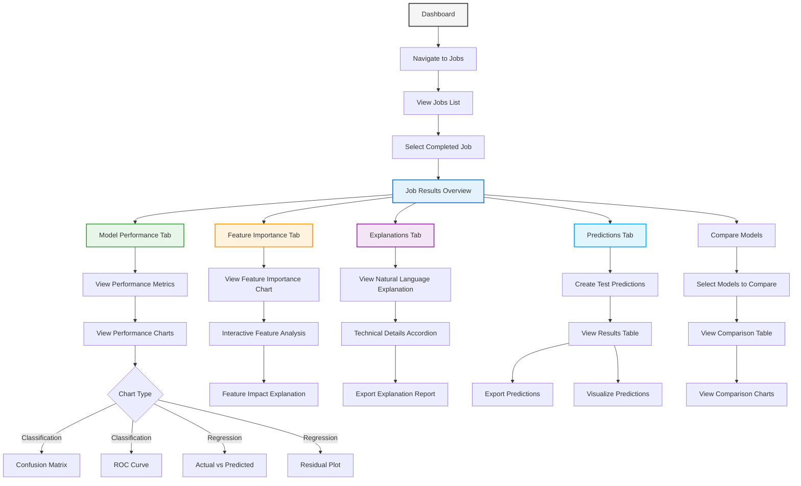

# Results Visualization User Flow

This diagram illustrates the results visualization workflow in PackageML:

1. **Results Access**:
   - Navigate to a completed job from the jobs list
   - View an overview of the job results
   
2. **Performance Analysis**:
   - View performance metrics relevant to the task type
   - Explore various visualization types:
     - Classification: confusion matrix, ROC curve, precision-recall
     - Regression: actual vs predicted, residual plots
   
3. **Feature Importance Analysis**:
   - Visual ranking of feature importance
   - Interactive exploration of how features impact predictions
   - Drill-down into specific feature effects
   
4. **Model Explanation**:
   - Plain-language explanations of how the model works
   - Technical details available for advanced users
   - Exportable reports for sharing with stakeholders
   
5. **Prediction Testing**:
   - Create test predictions using sample data
   - View and export prediction results
   - Visualize predictions on charts
   
6. **Model Comparison**:
   - Compare multiple trained models side-by-side
   - Analyze differences in performance and feature importance

The visualization flow is designed to make complex ML results accessible and actionable for both technical and non-technical users, with a focus on transparent, explainable AI. 